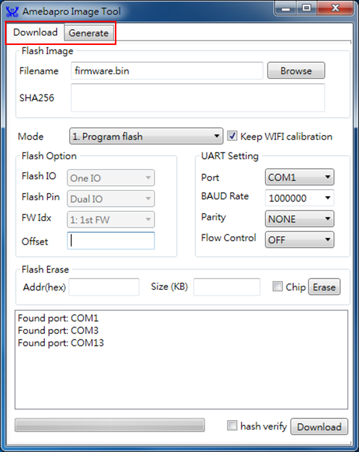
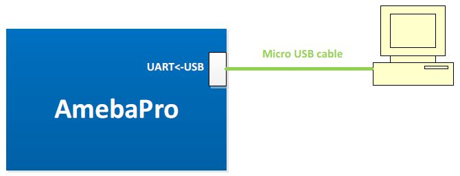
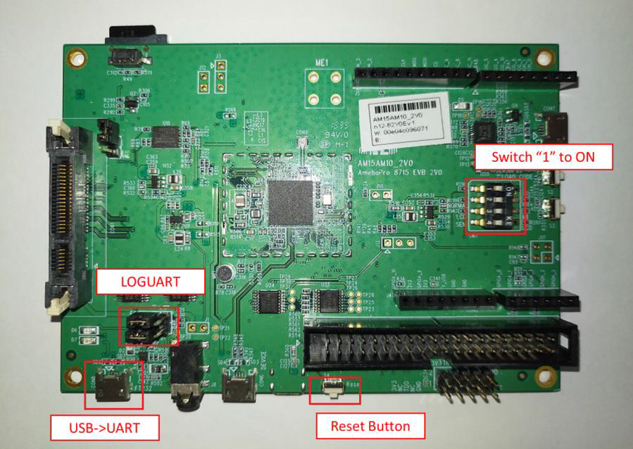
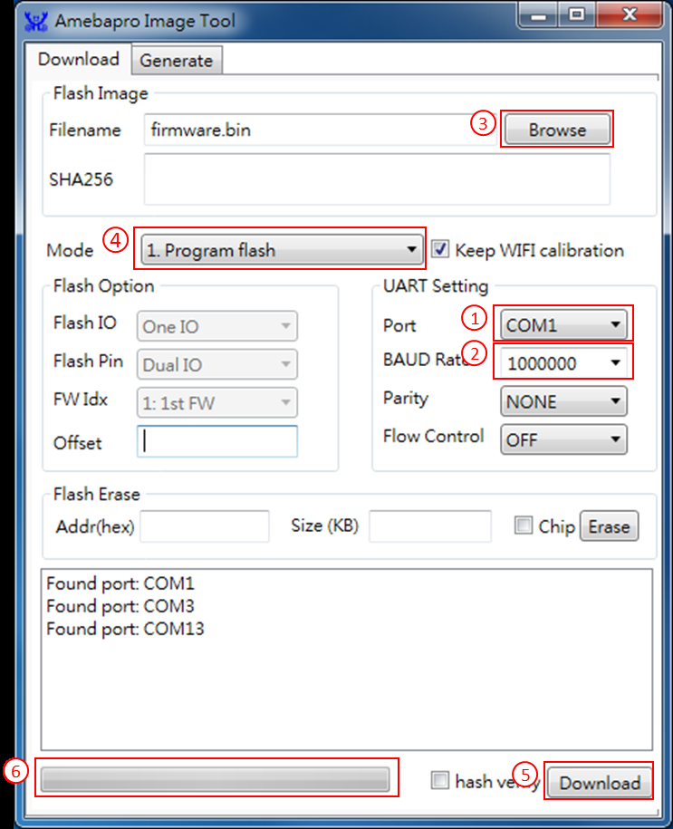
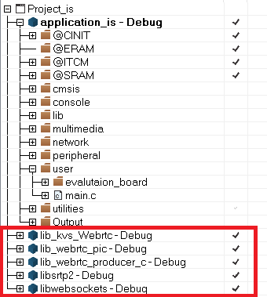
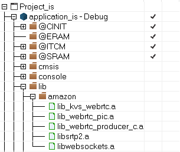
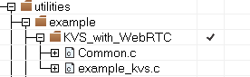

# AmebaPro
SDK for Realtek AmebaPro chipset  
This project is going to demonstrate how to use KVS with WebRTC on AmebaPro  
The related example code: `project\component\common\example\kvs_amazon`  
Please refer to the readme.TXT in example directory to check the corresponding setting is ok  

## Description
This article introduces users how to develop AmebaPro. AmebaPro is composed of one main board, one sensor board, and one daughter board with LED, light sensor, and IRLED. AmebaPro SDK provides all the example source code for the function mentioned above.  
To get start, users will need to set up the software to program the board.  
IAR IDE provides the toolchain for AmebaPro. It allows users to write programs, compile and upload them to your board. Also, it supports step-by-step debug. Realtek also provides Image Tool for users to do downloading code process.  

## Requirement
Please use IAR version 8.3 (There may be some compiler problems with v8.4)  

## Clone Project  
To check out this repostiory:

```
git clone --recurse-submodules https://github.com/HungTseLee/ambpro_sdk.git
```

If you already have a checkout, run the following command to sync submodules:

```
git submodule update --init
```

## SDK Project introduction
Currently users can use ignore secure mode. Project_is(ignore secure) is the project without Arm TrustZone technology. This project is easier to develop and suit for firsttime developer.  

## Compile program
AmebaPro use the newest Big-Little architecture. Big CPU is 300MHz, supporting high speed function like WiFi, ISP, Encoder and Codec. Little CPU is 4MHz, supporting low power peripheral function. Big CPU supports power-save mode while little CPU is operating. Big CPU power-save mode can be awaked by event trigger. Since the big CPU will depend on the setting of small CPU, it is necessary to compile the small CPU before the big CPU.  

### Compile little CPU
Step1. Open SDK/project/realtek_amebapro_v0_example/EWARMRELEASE/Project_lp.eww.  
Step2. Confirm application_lp in WorkSpace, right click application_lp and choose “Rebuild All” to compile.  
Step3. Make sure there is no error after compile.  

### Compile big CPU
Step1. Open SDK/project/realtek_amebapro_v0_example/EWARMRELEASE/Project_is.eww.  
Step2. Confirm application_is in WorkSpace, right click application_is and choose “Rebuild All” to compile.  
Step3. Make sure there is no error after compile.  

### Generating image (Bin)
After compile, the images partition.bin, boot.bin, firmware_is.bin and flash_is.bin can be seen in the EWARM-RELEASE\Debug\Exe.  
Partition.bin stores partition table, recording the address of Boot image and firmware image. Boot.bin is bootloader image; firmware_is.bin is application image, flash_is.bin links partition.bin, boot.bin and firmware_is.bin. Users need to choose flash_is.bin when downloading the image to board by Image Tool.  

## Using image tool to download image
Execute ImageTool.exe from location `project\tools\AmebaPro\Image_Tool\ImageTool.exe`  
As show in the following figure, Image Tool has two tab pages:  
* Download: used as image download server to transmit images to AmebaPro through UART  
* Generate: concat separate images and generate a final image  

<br> 
<br> 
<br>
 
Image tool use UART to transmit image to AmebaPro board. Before performing image download function, AmebaPro need to enter UART_DOWNLOAD mode first. Please follow below steps to get AmebaPro into UART_DOWNLOAD mode:  

<br> 

Step1: Connect LOGUART with FT pin by jumper cap.  
Step2: Connect USB->UART to PC by using micro-USB wire.  
Step3: Switch “1” to ON from SW7(2V0、2V1) or Switch “2” to ON from SW7(1V0)  
Step4: Push reset button.  

<br> 

To download image through Image Tool, device need to enter UART_DOWNLOAD mode first.  
Steps to download flash are as following:  

Step1: Application will scan available UART ports. Please choose correct UART port. Please close other UART connection for the target UART port.  
Step2: Choose desired baud rate between computer and AmebaPro.  
Step3: Choose target flash binary image file “flash_xx.bin”  
Step4: Check Mode is “1. Program flash”  
Step5: Click “Download”  
Step6: Progress will be shown on progress bar and result will be shown after download finish.  

## Using JTAG/SWD to debug
JTAG/SWD is a universal standard for chip internal test. The external JTAG interface has four mandatory pins, TCK, TMS, TDI, and TDO, and an optional reset, nTRST. JTAG-DP and SW-DP also require a separate power-on reset, nPOTRST. The external SWD interface requires two pins: bidirectional SWDIO signal and a clock, SWCLK, which can be input or output from the device.  

## How to use example source code
### Application example source
The examples for AmebaPro application is the SDK/common/example file. All the example provide related files including .c,.h, and readme. The readme file explains how to compile and important parameter.  
After opening IAR, the first step is adding example source code(.c) into application_is -> utilities -> example(right click example and choose Add -> Add Files or drag-and-drop the file into it ).  
After adding example code, user should use platform_opts.h to switch on the example. For example, if users are going to use DCT function, compile flag CONFIG_EXAMPLE_DCT should be set to 1, which means  
`#define CONFIG_EXAMPLE_DCT 1`  
In platform_opts.h so that the example function in example_entry will execute. After this procedure, rebuild application_is project to execute the example.  

### Peripheral example source
Peripheral example source can help us utilize peripheral function. Peripheral example source code locates in SDK/project/realtek_amebapro_v0_example/example_sources.  
There are main.c and readme.txt in each example file. The main.c in the example should be used to replace original main.c( in SDK/project/realtek_amebapro_v0_example/src).  
The readme file explains how to compile and important parameter. After that, rebuild application_is project to execute the Peripheral example.  

## Rebuild the library and compile the application project again  
If the source codes in library are modified, the corresponding library should be rebuild.  

<br> 

Then, go back to application_is project and "Make" again, the updated library can then be linked.

<br> 

## Add independent and additional include directories to specific example   
The additional include directories of KVS with WebRTC example is temporarily independent.
You can add additional include path by right clicking `KVS_with_WebRTC` and choosing `options` --> `C/C++Compiler` --> `Preprocessor`  

<br>  

## Set Up an AWS Account and Create an Administrator  
Please refer AWS official instruction to get **Access key ID** and **Secret access key**  
https://docs.aws.amazon.com/kinesisvideostreams-webrtc-dg/latest/devguide/gs-account.html  

Aftering getting the key, enter your key in the following place `utilities` --> `example` --> `KVS_with_WebRTC` --> `Common.c`  
```
pAccessKey = "???";  
pSecretKey = "???";  
```
Make application_is project again, make sure your key can be used on amebapro.  
## Put the CA file in SD card  
There is a `cert.pem` file in `lib_amazon\amazon-kinesis-video-streams-webrtc-sdk-c\certs`  
Please copy it to your SD card.  

## Running WebRTC Test Page Locally  
Refer the link from **AWS labs**, using the WebRTC SDK Test Page to validate the demo  
https://github.com/ycyang1229/amazon-kinesis-video-streams-webrtc-sdk-js/tree/test4porting  
you have to clone the above project and follow the step in **Development** part to run the test page  

